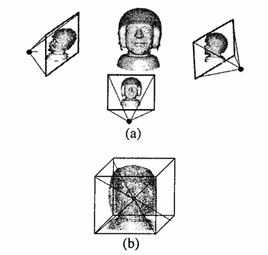
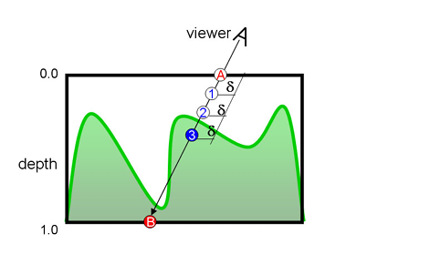

# MIRI_FRR

# IBO & Relief Mapping

Project implemented using WebGL/Three.js.
It features relief mapping, and binary search for intersection refinement. Also performance visualizations.

## Live Demo
You can access and test the live project directly from your browser here: https://sescobar99.github.io/MIRI_FRR/

## Local Installation

To run the project locally

1. Install [Node.js](https://nodejs.org/) in your machine
2. Unfold the project.
3. Navigate to the project directory in your terminal and install the dependencies:
   ```bash
   npm install
   ```
4. Start the local development server:
   ```bash
   npm run dev
   ```
5. Open the localhost link provided in your terminal in your web browser.


---------

# Video Demo

1. Orbit controls: Left: Rotate. Right: Pan. Scroll: Zoom
2. Screen: Top left: fps. Top Right: Interactable UI
3. Explore the model as is.
4. Interact with:
	1. Binary Search Extension
	1. Face Scale
	1. Height Scale (depth)
	1. Error heatmap (number of steps needed)
	1. Rebaking textures
5. Local Demo for using huge model (1GB size)
	1. Interact with High Poly  UI (bounding wireframe, show model, model position)
	1. Focus on the performance gain
	
6. Code overview of main aspects
	1. Texture Baking (IBOGenerator.js): 
		1. 
		1. Set up orthographic cameras aligned to each face of the bounding box. 
		1. Two pass render to texture using custom shaders. 
			1. First texture: contains Normal.xyz and Depth in alpha channel
			1. Second texture: a regular rgba		
		
	2. Raymarching In the fragment shader (shader.frag):
		1. 
		1. Transform the camera's view ray into Tangent Space.
		1. Use a fixed-step linear search to find where the ray drops below the recorded depth surface..
	
	3. Binary Search:
		1. Once the linear search finds the rough intersection interval (if binary search is active)
		1. It repeatedly halves the distance, jumping back and forth across the boundary to find a better value for more accurate intersection.
	